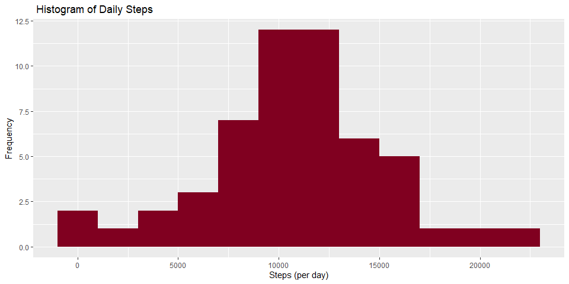
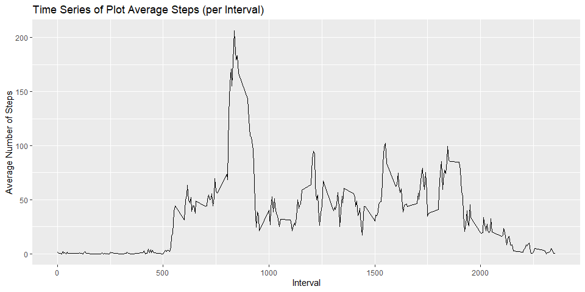
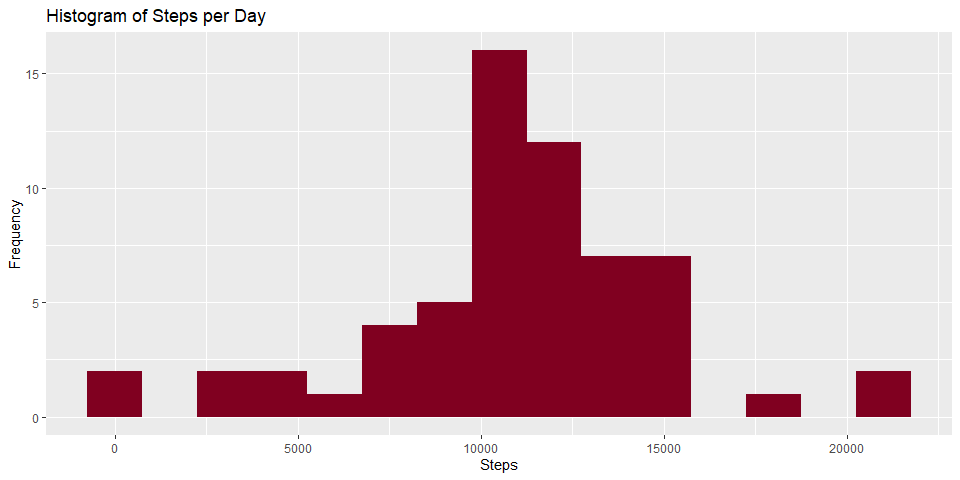
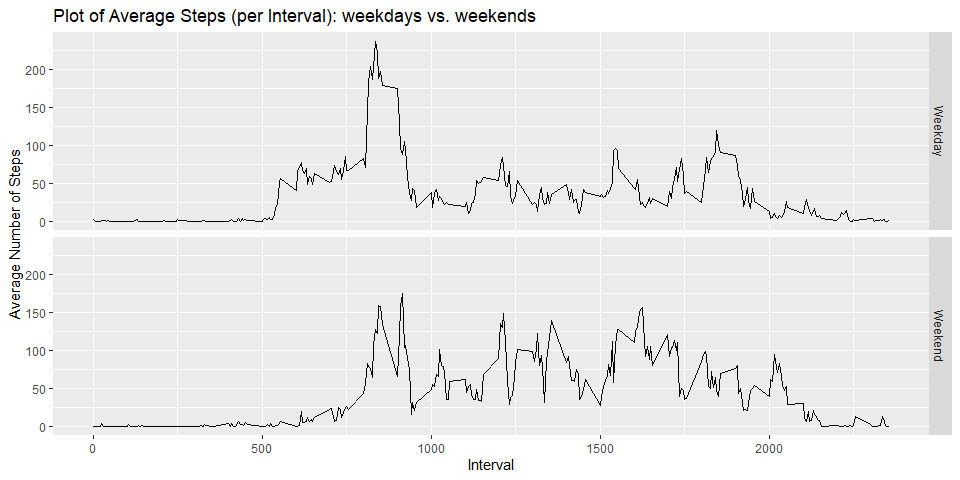

## Introduction
It is now possible to collect a large amount of data about personal movement using activity monitoring devices such as a Fitbit, NIke Fuelband, or Jawbone Up. These type of devices are part of the “quantified self” movement – a group of enthusiasts who take measurements about themselves regularly to improve their health, to find patterns in their behavior, or because they are tech geeks. But these data remain under-utilized both because the raw data are hard to obtain and there is a lack of statistical methods and software for processing and interpreting the data.

## Data
This assignment makes use of data from a personal activity monitoring device. This device collects data at 5 minute intervals through out the day. The data consists of two months of data from an anonymous individual collected during the months of October and November, 2012 and include the number of steps taken in 5 minute intervals each day.

The data for this assignment can be downloaded from the course web site:
* Dataset: Activity monitoring data

The variables include in this dataset are:
* steps:Number of steps taking in a 5-minute interval (missing values aer coded as NA)
* data: The data on which the measurement was taken in YY-MM-DD format
* interval: Identifier for the 5-minute interval in which measurement was taken

The dataset is stored in a comma-separated-value (CSV) file and there are a total of 17,568 observation in this dataset


## Assignment Tasks and Questions


```r
# Settings and packages

setwd(setwd("C:/Users/piejf/Desktop/COURSERA/Data Science Foundations using R Specialization/5 Reproducible Research/Week 2"))

knitr::opts_chunk$set(echo = TRUE, warning = FALSE, fig.width = 10, fig.height = 5,
                      fig.keep = 'all' ,fig.path = 'figures\ ', dev = 'png')

library(dplyr)
```

```
## 
## Attaching package: 'dplyr'
```

```
## The following objects are masked from 'package:stats':
## 
##     filter, lag
```

```
## The following objects are masked from 'package:base':
## 
##     intersect, setdiff, setequal, union
```

```r
library(ggplot2)
```

***
***
***

#### * Loading and preprocessing the data


```r
# DUnzipping and reading dataset
# Unzipping file
path = getwd()
unzip("repdata_data_activity.zip", exdir = path)
```
#### 1. Load the data (i.e.read.csv)

```r
act <- read.csv("activity.csv")
```

#### 2. Process/transform the data (if necessary) into a format suitable for your analysis
###### Date Formatting

```r
act$date<-as.Date(act$date, "%Y-%m-%d")

## Checking processed data
str(act)
```

```
## 'data.frame':	17568 obs. of  3 variables:
##  $ steps   : int  NA NA NA NA NA NA NA NA NA NA ...
##  $ date    : Date, format: "2012-10-01" "2012-10-01" ...
##  $ interval: int  0 5 10 15 20 25 30 35 40 45 ...
```

***
***
***

#### * What is mean total number of steps taken per day?

The histogram plot shows the total steps per day with median around 10000 steps. Specifically the statistics show that the minimum value is at 41 steps, median at 10765 steps, mean at 10766 steps, and maximum at 21194 steps. Further details on this are shown below (See graph and values)


#### 1. Calculate the total number of steps taken per day
###### Total steps

```r
stepsday <- aggregate(steps ~ date, act, FUN = sum)
```


#### 2. Make a histogram of the total number of steps taken each day
###### Plotting

```r
g <- ggplot (stepsday, aes (x = steps))
g + geom_histogram(fill = "#800020", binwidth = 2000) +
    labs(title = " Histogram of Daily Steps ", x = "Steps (per day)", y = "Frequency")
```

<!-- -->


#### 3. Calculate and report the mean and median of the total number of steps taken per day
###### Mean

```r
stepsmean<-mean(stepsday$steps)
stepsmean
```

```
## [1] 10766.19
```
###### Median

```r
# Median
stepsmedian<-median(stepsday$steps)
stepsmedian
```

```
## [1] 10765
```

***
***
***

#### * What is the average daily activity pattern?

The line plot shows the time series plot of average steps per interval with interval 835 containing the maximum number of steps which is 206.1698 Refer to the values and plot below for more information.


#### 1. Make a time series plot (i.e. type = "l") of the 5-minute interval (x-axis) and the average number of steps taken, averaged across all days (y-axis)

```r
# Average number of steps per interval (5 minutes)
stepsint<-aggregate(steps~interval, act, mean)

# Time series of average number of steps per interval
line<- ggplot (stepsint, aes(x=interval, y=steps)) + geom_line()+labs(title="Time Series of Plot Average Steps (per Interval)",x="Interval", y="Average Number of Steps")

line
```

<!-- -->


#### 2. Which 5-minute interval, on average across all the days in the dataset, contains the maximum number of steps?

```r
maxint<-stepsint[which.max(stepsint$steps),]
```

***
***
***


#### * Imputing missing values

#### 1. Calculate and report the total number of missing values in the dataset (i.e. the total number of rows with NAs)

```r
sum(is.na(act$steps))
```

```
## [1] 2304
```

```r
## Answer: The total number of missing values in the dataset is 2304.
```


#### 2. Devise a strategy for filling in all of the missing values in the dataset. The strategy does not need to be sophisticated. For example, you could use the mean/median for that day, or the            mean for that 5-minute interval, etc.

Note: Here the missing values are substituted with the average number of steps using the dataset with the interval and weekdays variable

```r
act_1<- read.csv("activity.csv", header=TRUE, sep=",")

## Create variable with weekdays
act_1$day<- weekdays(as.Date(act_1$date))

## Derive average
avgsteps<-aggregate(steps ~ interval + act_1$day, act_1, mean)
colnames(avgsteps) <- c("interval", "day", "steps")

## Get the NA values into a dataset
na<-act_1[is.na(act_1$steps),]

## Bind NA data set with 5 min interval with weekdays for substitution
na_act<-merge(na, avgsteps, by=c("interval", "day"))

activityNA<- subset(na_act, select=c(1,2,4,5))
```


#### 3. Create a new dataset that is equal to the original dataset but with the missing data filled in.


```r
## Get data without NAs
act_noNA <- act_1[!is.na(act_1$steps),]

## Cleaning data
act_2<-subset(na_act, select=c(5,4,1,2))
colnames(act_2) <- c("steps", "date", "interval", "day")

## merging data
merge_act<-rbind(act_noNA, act_2)
```


#### 4. Make a histogram of the total number of steps taken each day and Calculate and report the mean and median total number of steps taken per day. Do these values differ from the estimates from            the first part of the assignment? What is the impact of imputing missing data on the estimates of the total daily number of steps?


```r
## Deriving total steps per day 
stepsperday<- aggregate(steps~date, merge_act, FUN=sum)

## Histogram
hist_4<- ggplot (stepsperday, aes(x=steps))
hist_4 + geom_histogram(fill="#800020", binwidth=1500) + labs(title="Histogram of Steps per Day", x="Steps", y="Frequency", xlim=25000)
```

<!-- -->


The mean of the imputed data increased from the original data. The imputed data mean is 10821.21 while the original mean is at 10766.18.

```r
# Mean total steps using imputed data
meanstepsperday<- mean(stepsperday$steps, na.rm=TRUE)
meanstepsperday
```

```
## [1] 10821.21
```


The median of the imputed data increased from the original data. The imputed data median is 11015 while the original mean is at 10765.

```r
# Median total steps using imputed data
medianstepsperday<- median(stepsperday$steps, na.rm=TRUE)
medianstepsperday
```

```
## [1] 11015
```

***
***
***

##### * Are there differences in activity patterns between weekdays and weekends?

#### 1. Create a new factor variable in the dataset with two levels – “weekday” and “weekend” indicating whether a given date is a weekday or weekend day.


```r
# New variable showing weekday or weekend
merge_act$day_type<- ifelse(merge_act$day %in% c("Saturday", "Sunday"), "Weekend", "Weekday")
```


#### 2. Make a panel plot containing a time series plot (i.e. type = "l") of the 5-minute interval (x-axis) and the average number of steps taken, averaged across all weekday days or weekend days (y-axis). See the README file in the GitHub repository to see an example of what this plot should look like using simulated data.


```r
# table containing average steps per time intercal accross weekday and weekend days
stepsperinterval<- aggregate(steps~interval+day_type, merge_act, FUN=mean)

#panelplot
panelplot<- ggplot(stepsperinterval, aes(x=interval, y=steps)) + geom_line()+ labs(title = "Plot of Average Steps (per Interval): weekdays vs. weekends", x = "Interval", y = "Average Number of Steps") + facet_grid(day_type~ .)

panelplot
```

<!-- -->


